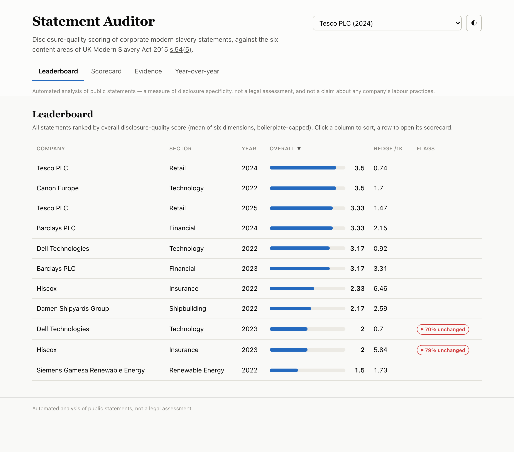
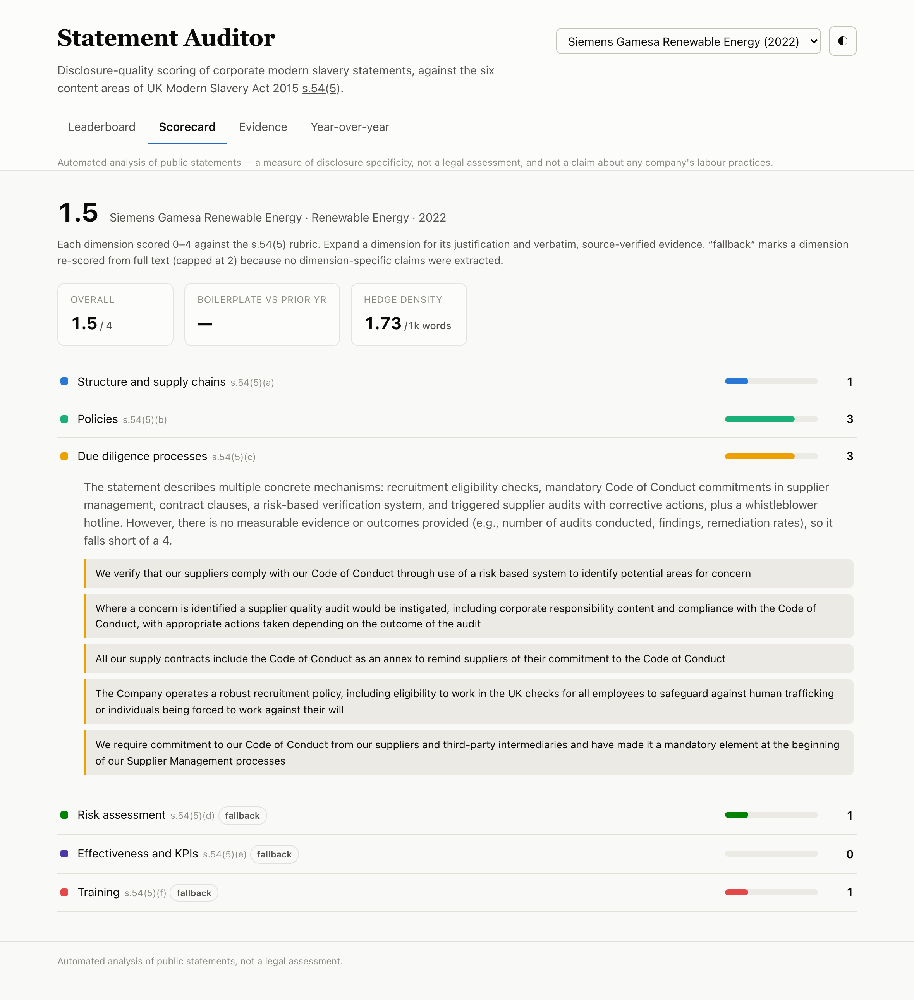
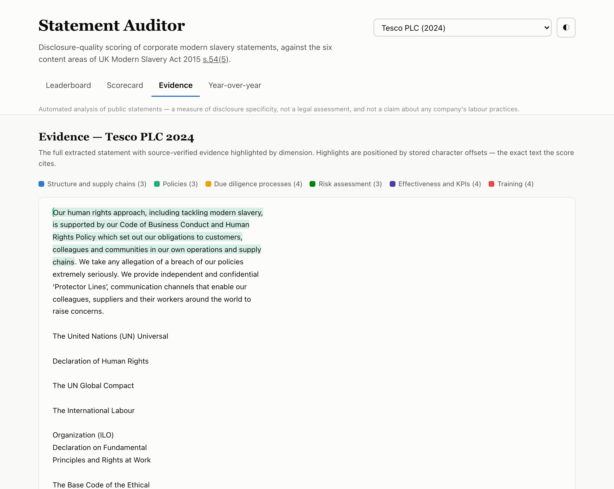
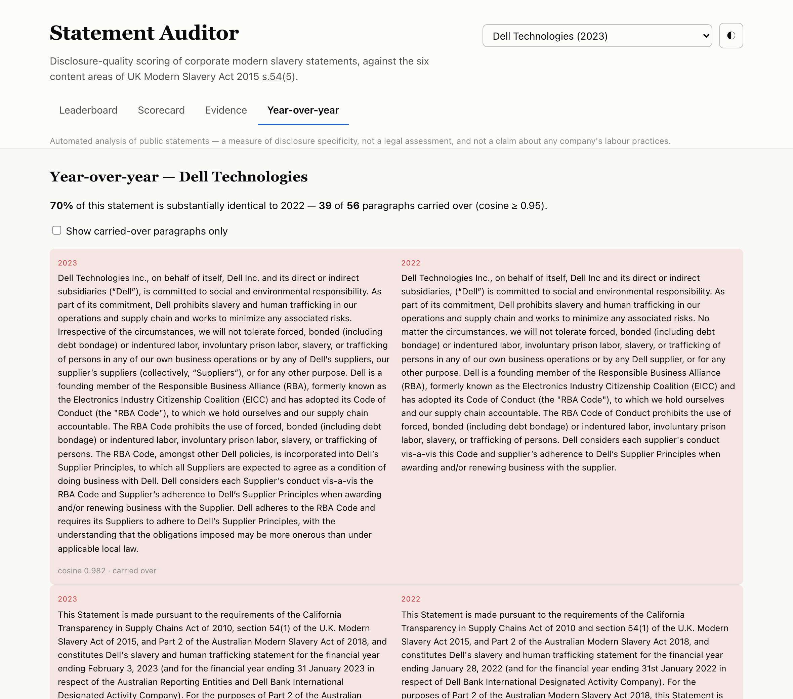

# Statement Auditor

Ingests public corporate **modern slavery statements**, scores them against a
fixed accountability taxonomy anchored to the UK Modern Slavery Act, and
presents the results in a comparative dashboard with sentence-level evidence and
year-over-year boilerplate detection.

> **Automated analysis of public statements — not a legal assessment.** This
> tool measures **statement quality** and **disclosure specificity**. It never
> asserts that any company uses forced labour.

## What it scores

Seven dimensions. Dimensions 1–6 map directly to the six recommended content
areas in **section 54(5) of the UK Modern Slavery Act 2015**
([legislation.gov.uk](https://www.legislation.gov.uk/ukpga/2015/30/section/54)).
The 0–4 rubric and dimension definitions are derived from that section.

| # | Dimension | s.54(5) |
|---|-----------|---------|
| 1 | Structure and supply chains | (a) |
| 2 | Policies | (b) |
| 3 | Due diligence processes | (c) |
| 4 | Risk assessment | (d) |
| 5 | Effectiveness and KPIs | (e) |
| 6 | Training | (f) |
| 7 | Boilerplate score (**computed**, not LLM-scored) | — |

**Rubric (dimensions 1–6, scored 0–4):**

| Score | Meaning |
|-------|---------|
| 0 | Not addressed |
| 1 | Mentioned, no substance |
| 2 | General commitments, no mechanisms |
| 3 | Concrete mechanisms described, weak or no measurement |
| 4 | Concrete mechanisms plus measurable evidence or outcomes |

**Overall score** = mean of dimensions 1–6, penalized by boilerplate. If the
boilerplate share exceeds 0.6, the overall is capped at 2.0 and flagged
"substantially unchanged from prior year".

## How it works

Two LLM passes (never one giant prompt), plus a computed diff:

1. **Extraction** (`claude-haiku-4-5`) — pull verbatim claims per dimension into strict JSON. PDFs are read with PyMuPDF, whose block-level reading order keeps multi-column text contiguous so quotes stay verbatim.
2. **Scoring** (`claude-sonnet-5`) — score each dimension 0–4 against the rubric, sampled 3× with the **median** taken (see stability note below). Cited evidence is **verified to exist verbatim** in the source, and the exact source span is stored and shown (never the model's paraphrase).
3. **Boilerplate diff** — embed paragraphs (`all-MiniLM-L6-v2`), compute year-over-year paragraph similarity (threshold calibrated to 0.95), and measure hedge-word density.

All LLM responses are cached on (model, prompt hash), so re-runs are free and deterministic. Model names, thresholds, and the hedge lexicon all live in [`config.yaml`](config.yaml).

## Dashboard

Four views over `dashboard/data.json` (a single static page — plain HTML/JS, no build step, light/dark).

**Leaderboard** — all statements ranked by overall score; sortable; boilerplate flag.



**Scorecard** — one company: six dimension bars, boilerplate + hedge tiles, each dimension expandable to its justification and source-verified evidence. A `fallback` badge marks any dimension re-scored from full text (capped at 2).



**Evidence** — the full statement with evidence highlighted by dimension, positioned by stored character offsets (never re-matched in the browser).



**Year-over-year** — side-by-side paragraphs with the "N% substantially identical" headline; carried-over-only toggle; paginated.



## Repo layout

```
statement-auditor/
  config.yaml            # models, thresholds, paths, hedge lexicon
  sources.csv            # company_slug, company_name, sector, year, pdf_url
  requirements.txt
  data/
    raw/                 # downloaded PDFs: {company_slug}_{year}.pdf
    text/                # extracted plain text
    cache/               # cached LLM responses (model, prompt hash)
    statements.db        # SQLite (single file, no server)
  src/
    schemas.py           # pydantic models for all structured outputs
    taxonomy.py          # dimension definitions + rubric (from s.54(5))
    config.py            # config + path resolution; API key from env (.env supported)
    sources.py           # load sources.csv; on-disk {slug}_{year} naming
    llm.py               # Anthropic client + cached structured-output helper
    verify.py            # evidence verification -> exact source span
    store.py             # SQLite persistence + dashboard JSON export
    ingest/
      fetch.py           # download & validate PDFs (browser UA, 403 -> skip)
      extract.py         # PDF -> cleaned text (PyMuPDF, column-aware)
    pipeline/
      claims.py          # LLM pass 1: claim extraction
      score.py           # LLM pass 2: rubric scoring + evidence verifier + fallback
      diff.py            # dimension 7: YoY similarity + hedge density
    run.py               # CLI: python -m src.run --all | --company <slug>
  dashboard/             # single-page comparative dashboard + data.json
```

## Setup

The Anthropic API key is read from the environment — never hardcoded.

> **Python version:** use **3.11 or 3.12**. `torch`/`sentence-transformers`
> (needed for the year-over-year diff) do not yet publish wheels for Python 3.14.

```bash
python3.12 -m venv .venv && source .venv/bin/activate   # 1
pip install -r requirements.txt                          # 2
export ANTHROPIC_API_KEY=sk-ant-...                      # 3
python -m src.run --all                                  # 4  (see the Tesco note below first)
python -m http.server -d dashboard 8000                  # 5  -> http://localhost:8000
```

`sources.csv` is already populated (11 statements across 7 companies). The first
`--all` run also downloads the `all-MiniLM-L6-v2` model (~90 MB) for the diff.

### One manual step: Tesco (the only source that isn't auto-fetchable)

`tescoplc.com` sits behind a CDN that returns **HTTP 403** to scripted clients, so
`fetch.py` logs and skips both Tesco statements and the batch continues (every
other source is registry- or issuer-hosted and downloads automatically). To
include Tesco, download the two PDFs in a **browser** and save them to these exact
paths, then re-run step 4:

| Open in a browser | Save as (relative to repo root) |
|---|---|
| `https://www.tescoplc.com/media/4h2d5o1x/modern-slavery-statement-2023_24_final.pdf` | `data/raw/tesco_2024.pdf` |
| `https://www.tescoplc.com/media/ahag4vn0/modern-slavery-statement-2024_25_v15.pdf` | `data/raw/tesco_2025.pdf` |

Without this step you get 6 of the 7 companies (everything except Tesco); `extract.py`
picks the PDFs up from `data/raw/` on the next run regardless of how they arrived.

## Adding statements (`sources.csv`)

Populate `sources.csv` with 15–25 direct PDF URLs. For at least 5 companies,
include **two consecutive years** so the year-over-year diff has data. Header:

```csv
company_slug,company_name,sector,year,pdf_url
```

Direct-PDF sources come from public registries such as the
[UK registry](https://modern-slavery-statement-registry.service.gov.uk) and the
[Australian registry](https://modernslaveryregister.gov.au). `fetch.py` validates
that each URL returns a real PDF and skips non-PDF landing pages.

## Framing

- Output is framed as **statement quality** and **disclosure specificity** — never as an accusation of forced-labour use.
- Every dashboard view carries the disclaimer: *automated analysis of public statements, not a legal assessment.*

## Methodology notes & known limitations

**Score stability (median-of-3).** Claude Sonnet 5 does not accept a temperature
parameter, so to tame run-to-run variance each dimension is scored 3× and the
median is taken (`scoring_samples` in `config.yaml`). Each sample is cached
independently, so the committed cache/DB is **deterministic** — re-running the
demo yields identical numbers. One dimension, **Policies**, is genuinely
borderline between 2 ("general commitments") and 3 ("concrete mechanisms") for
several statements; on a cold re-run (cache cleared) its median can still move by
one point. Adopting median-of-3 shifted three overalls via Policies vs an earlier
single-shot run — Tesco 2024 3.33→3.50, Tesco 2025 3.50→3.33, Barclays
3.17→3.33; all other dimensions held.

**Single-dimension classification + zero-claim fallback.** Pass 1 assigns each
claim to exactly one dimension. A sentence touching two dimensions (e.g. "Tier 1
supplier sites via Sedex" — both *structure* and *due diligence*) is filed under
one, which can leave the other looking empty. To avoid a **false 0**, any
dimension with zero extracted claims triggers a **full-text fallback**: the
scorer re-reads the whole statement for that dimension only, cites verbatim
evidence, and is **capped at 2** — it recovers "mentioned" (1) or "general
commitment" (2) from "missed", never a mechanism-level 3–4 (which requires
claim-grounded evidence). A genuine omission still scores 0. Example: Siemens
Gamesa's risk and training moved 0→1 (real passing mentions) while KPIs stayed 0
(no metrics anywhere in the document). A regression check confirms the fallback
touches only zero-claim dimensions.

**Evidence is the source's words.** Verbatim matching tolerates cosmetic
differences (case, punctuation, bullets, hyphenation), but the stored/displayed
quote is the exact span sliced from the extracted text — so a reviewer opening
the PDF finds it.

**Boilerplate threshold.** Calibrated on the Tesco 2024→2025 pair: at 0.92 the
boundary admitted paragraphs where only figures changed ("USD 2.7m" vs "USD
3.6m"); at ≥0.95 every flagged pair is genuine verbatim reuse.

## Build status

Built incrementally, verifying each stage on real data before the next:

- [x] **1. Schemas, config, repo skeleton**
- [x] **2. `fetch.py` + `extract.py`** — verified on real PDFs (PyMuPDF, column-aware; 403 → skip)
- [x] **3. `claims.py`** — 87–96% verbatim-match extraction
- [x] **4. `score.py`** — rubric scoring, evidence verifier, median-of-3, zero-claim fallback
- [x] **5. `diff.py`** — YoY boilerplate (calibrated threshold) + hedge density
- [x] **6. SQLite persistence + `run.py` CLI** — end-to-end batch of 6 statements
- [x] **7. Dashboard** — leaderboard · scorecard · evidence · YoY diff (light/dark, verified)
- [x] **8. Full registry batch + acceptance pass** — 11 statements / 7 companies; consecutive-year pairs sampled from the registry's CSV export; all four acceptance criteria verified
